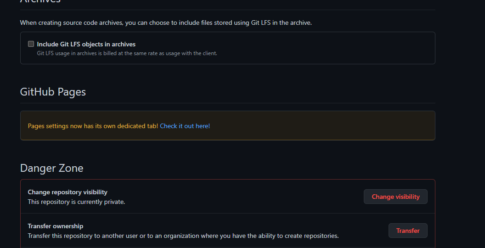
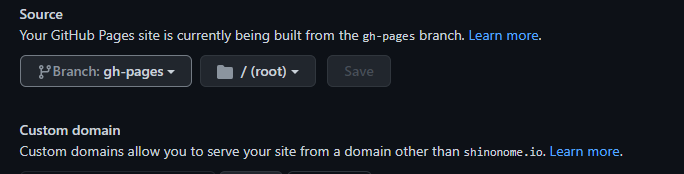
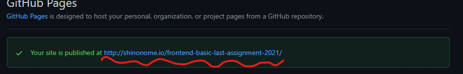

### 作るもの

今まで作成したコンポーネントを使ってページを完成させていきます。

### 手順

1. まず、各コンポーネントで作成した.scss ファイルを.css ファイルに書き出す処理（コンパイル）を行います。VSCode の画面上部にある Terminal > New Terminal をクリックし、Terminal を表示してください。（コマンドプロンプトや bash 等を使っていただいても結構です。）
2. Terminal に`yarn build-sass`と入力しエンターキーを押すと、コンパイルが開始します。完了すると src/page ディレクトリに style.css というファイルが生成されます。このファイルに今まで作成してきた全ての scss ファイルの内容が css の記法に変換されて書き出されています。試しにファイルを開いて、今までに作成したコンポーネントのクラスの名前を検索(Ctrl or Command + f)してみると分かりやすいかもしれません。
3. 今まで Organisms、Templates として作成した部品を、src/page/index.htmlの body の中にコピー＆ペーストして並べていきます。順番が前後しないよう気をつけてください。
4. index.html を保存し、chrome で開いて表示がお手本サイトと違っていないか確認しましょう。検証ツールを活用して、画面幅によってレイアウトが崩れていないかもよく見直しましょう。
5. 見た目に問題があったら該当するパーツに戻って修正し、1. 2.の手順を踏んで style.css を更新してもう一度確認しましょう。修正ができたら修正したファイルだけをコミットしておくと、何の修正をしたのか分かりやすいとともに、やはり間違っていたとき元に戻すことがしやすいのでしておきましょう。
   > たまに style.css がブラウザにキャッシュ（読み込み時間を短縮するために一度ダウンロードしたファイルを一時的に保存する機能）されてしまって修正した内容が反映されないことがあります。その場合はブラウザのキャッシュを削除して対応してください。
6. 問題を解決したらプルリクエストを出してください。**今回の課題はstorybookを使用しません。**
7. 次にGithub Pagesの設定を行います。Github PagesとはGithubのリポジトリの内容をウェブサイトとして簡易的に公開できるサービスです。storybookを使用しない代わりにレビューの際はこれを使ってページ全体の見た目をレビューします。
8. まず、GithubのリポジトリのページのSettingsタブをクリックし、Optionsページの下の方にあるGithub Pagesを見ましょう。"Check it out here!!"のリンクがあると思うのでクリックするとGithub Pagesが有効になります。

9. するとSettingsのPagesページに飛ぶので、そこの中段にあるSourceの部分を見てください。"Branch:master"と書かれたドロップダウンがあるので、クリックしてgh-pagesというブランチに切り替えます。

10. 切り替えてしばらくすると、ページ上部の緑色のアラートにあるURLからindex.htmlの中身が見れるようになるので、そのURLをプルリクエストにコピペしてからレビューを依頼しましょう。

### 補足　使用した技術

#### gulp

style.css を書き出す工程で見慣れない操作をしたと思うのですが、あれが何なのか気になる方へ向けて簡単に説明させていただきます。
まず、実行したコマンド`yarn build-sass`は、package.json 内 scripts に定義されているもので、`gulp`コマンドを実行します。コマンドは yarn で統一した方が分かりやすいと考えてこれにしただけですので直接 gulp と打ち込んでも結果は変わりません。

gulp はあらかじめ定義しておいた一連の処理をまとめて実行する、タスクランナーと呼ばれるツールの一つです。他に似たものでは webpack があり、こちらはサーバーを立てて開発中にファイルの更新をブラウザに常に反映させるような運用に向いています。今まで使ってきた storybook にも内部で使われています。

gulp のタスクは gulpfile.js で定義することができます。今回は sass のコンパイルを実行するとともに、画像への相対パスの変換やファイルの結合、ミニファイ（コードから改行や不要な空白を取り除き全て 1 行にまとめる。データが削減され若干読み込み速度が改善する。）をしています。試しに gulpfile.js の 14 行目を`//`でコメントアウトして`yarn build-sass`を実行すると style.css の中身がミニファイされる前のものになるのが確認できると思います。

webpack の方が高機能ですが、比較的手軽に導入できるので、ちょっとした変換くらいだったらこっちを使うといいかもしれません。

#### Github Actions

今回の課題でプルリクエストを出したときに自動的にchromaticやGithub Pagesへのデプロイが行われていたと思います。これはGithubのGithub Actionsという機能によるものです。プルリクエストを出したときや、特定のブランチへマージが行われたときなどをトリガーとして、様々なタスクを自動的に実行できます。タスクの内容はリポジトリの.github/workflowsの中のファイルで定義することができます。

ソフトウェア開発において、ビルドやテストを自動化し品質管理を効率化することを継続的インテグレーション(Continous Integration略してCI)、変更したソフトフェアのリリース作業を自動化することを継続的デリバリー(Continuous Delivery略してCD)と呼び、合わせてCI/CDと呼ばれます。Github Actionsはこれらを実現するCI/CDツールの一つです。
