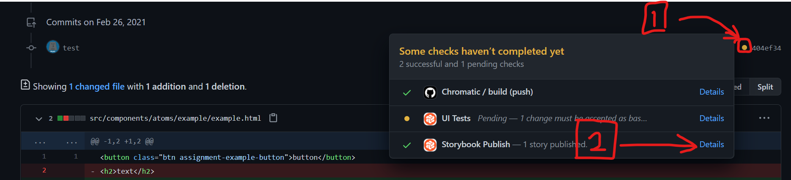

### Storybook とは

[Storybook](https://storybook.js.org/)とは、AtomicDesign に沿って作成された部品をカタログのように一覧表示するツールです。これを利用することで作成した部品のチェックのためにわざわざ完全な html ファイルを用意して表示する必要がなくなり、効率的に開発を進めることができます。

利便性を実感するためにもまずは使ってみることにしましょう。プロジェクトフォルダを VSCode で開き、Terminal > New Terminal からターミナルを表示してください。`yarn storybook`と入力し実行すると、しばらく処理が走った後自動的にブラウザが立ち上がり storybook の画面が表示されると思います。

終了したい場合はターミナル上で`Ctrl + C`または`Command + C`を入力すると停止します。ブラウザは手動で閉じてください。

最終課題フォルダ内 `/.storybook/preview-head.html` に記載されている内容が、storybook の preview の head タグ内に反映されています。そのため、最終課題で作成する html 内で読み込まずとも GoogleFonts や Bootstrap が使えるようになっています。

また、下で紹介する sass も css に変換した状態で storybook 全体に適用されるようになっています。そのため、作成済みのスタイルを別のコンポーネント内で使いたい場合（例: Molecules/Card 内で Atoms/Button を使いたい！）、card.scss 内にボタンのスタイルを書き直さずとも、ボタンの html をコピペしてくるだけで button.scss で定義されたスタイルが当たるようになっています。

#### 画面の見方

左のサイドバーからコンポーネントを選択すると、画面中央に表示されます。


上に並んでいるボタンのうち四角が重なっているみたいなマークのものを押すとプレビューの画面幅を選択できます。レスポンシブ対応する際に有効活用してください。（細かく幅を変えたい場合はブラウザの検証ツールを使用してください）


### 部品を作成する

部品は基本的に.html ファイル、.scss ファイル、.stories.js ファイルの三つを組み合わせて作成します。ここでは元々テンプレートに含まれている atoms/example のコードを例に説明していきます。

```html
/* src/components/atoms/example/example.html */

<button class="btn assignment-example-button">button</button>
<h2>text</h2>
```

```scss
/* src/components/atoms/example/example.scss */

@use "../../variables" as *;

.assignment-example-button {
  color: $color-example;
  font-size: $fontsize-example;
}
```

まず、html ファイルと scss ファイルを作成しましょう。html ファイルは html タグや body タグなどは書かず、部品の要素そのものだけを記述します。今回はボタンとテキストが並んでいる部品です。この際にスタイルを当てる部分や bootstrap を使いたい部分にクラスを指定しましょう。\
scss ファイルには、基本的には css のようにクラスに対しスタイルを当てていきます。今回はボタンの文字色とフォントサイズを指定しています。"\$"の記号から始まる文字列は sass の機能の一つである変数で、src/components/\_ variables.scss 内で定義しているものを 1 行目の@use で読み込んで使用しています。

これで部品自体は作れました。次はこの部品を storybook 上に表示するための設定ファイルを作成します。

```js
/* src/stories/atoms-example.stories.js */

import Item_Example from "../components/atoms/example/example.html";
import "../components/atoms/example/example.scss";

export default { title: "Atoms/Example" };

export const Example = () => Item_Example;
```

ファイル名は`<部品の種別>-<部品名>.stories.js`としてください。storybook は拡張子で設定ファイルを認識しているので、.stories.js にスペルミスが無いよう注意してください。\
まず、1 行目で html ファイル、2 行目で scss ファイルを読み込みます。html ファイルの情報は後で使うので、ここでは Item_Example という名前で参照します。\
次に、4 行目でこの部品の情報を設定します。今回は必要最低限の要素である部品の名前(title)だけ設定しています。ダブルクォーテーション(")で囲まれている部分がその内容となりますが、ここは`<部品の種別>/<部品名>`としてください。これによって storybook 上に表示される際に部品を種別ごとにグループ分けすることができます。\
最後に、6 行目でこの部品の内容を設定します。ここでは、部品のストーリー名（どういった状況で部品が使われているのかを表す。一つだけならば部品名や Default とかで良い）として Example、その中身として 1 行目で読み込んだ html ファイルの参照である Item_Example を指定しています。\
ここまで書いて保存すると storybook 上に反映されるはずです。もし反映されない場合は storybook を再起動してみてください。

### Chromatic

ここまで使用した storybook は自分の PC 上で動かしていました。しかし、チーム開発では部品のチェックは複数人で行いたいものです。そこで Chromatic の出番です。\
Chromatic は storybook をインターネット上で共有できるサービスです。作成した storybook をデプロイ（アップロードみたいな感じ）することでチームの全員が部品をブラウザから確認できるようになります。\
本課題では github の actions という機能を利用して、github 上に push するのと同時に chromatic へのデプロイも自動的に行う設定をしています。プルリクエストのページで画像の Detail をクリックするとデプロイされたページを確認することができます。


### Sass とは

Sass とは、css を効率的に記述するための「中間言語」と呼ばれる言語です。ファイルの拡張子は".scss"となります。".sass"ではないので注意しましょう。様々な機能がありますが、この課題では特に「変数」「@use」「階層構造の入れ子」を意識して書くようにしましょう。

変数は数学で出てくるやつと同じといえば同じですが、ここでは文字列が入ったりします。また、Sass では一度代入した値を変えることは滅多にないので定数といった方が正しいかもしれません。  
変数の定義は`$<変数名> : <値>;`で行います。今回の課題では src/components/\_ variables.scss 内で全ての変数を定義して、変数を使用するファイルで後述する@use で読み込んで使うようにしましょう。（2022 年度以降の課題では変数はもともと定義されているので、それを読み込んで使いましょう）  
変数は特に色とフォント関連のプロパティの指定でその威力を発揮します。もし開発終盤で色の変更やフォントサイズの変更があった場合、値を直接指定していたら該当する全てのファイルを修正しなくてはなりませんが、変数でしていしていればその定義の部分を修正するだけで済みます。

@use は他の scss ファイルで定義されている変数等を読み込んで使いたい時に使用します。構文は`@use <読み込むscssファイルへの相対パス> as <参照名>;`となっていて、参照名は基本的に自由に設定できます。読み込みができたら、`<参照名>.<使用する変数等の名前>`で使用することができます。また、参照名に"\*"を指定すると、使用する変数等の名前をそのまま使うこともできます。

階層構造の入れ子とは、以下のような書き方です。

```scss
.parent {
  hoge: fuga;

  .child {
    ugya: ogya;

    .grandchild {
      nya: pui;
    }
  }
}
```

これは以下のように変換されます。

```css
.parent {
  hoge: fuga;
}

.parent .child {
  ugya: ogya;
}

.parent .child .grandchild {
  nya: pui;
}
```

これによって html の階層構造に従いつつよりコンパクトにスタイルを記述できるので、積極的に使用しましょう。\
また、入れ子の中では、親要素を"&"で参照できます。具体的には、

```scss
.parent {
  & > .child {
    hoge: fuga;
  }

  &:hover {
    ugya: ogya;
  }

  &:hover .child {
    nya: pui;
  }
}
```

は

```css
.parent > .child {
  hoge: fuga;
}

.parent:hover {
  ugya: ogya;
}

.parent:hover .child {
  nya: pui;
}
```

となります。

scss ではメディアクエリも入れ子にできます。

```scss
.example {
  hoge: fuga;

  @media (max-width: $breakpoint-md) {
    hoge: fugafuga;
  }
}
```

このように書いた場合

```css
.example {
  hoge: fuga;
}

@media (max-width: 768px) {
  .example {
    hoge: fugafuga;
  }
}
```

このように変換されます。

他にも様々な機能や使い方があるので、書いていて気になったら調べてみてください。
