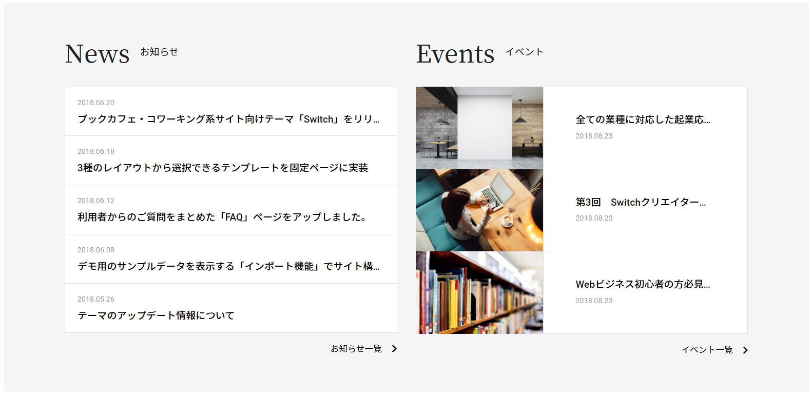

### 作るもの



### ファイル名、ディレクトリ構造

```
src
├ components
│ └ templates
│   └ news-and-events
│     ├ news-and-events.html
│     └ news-and-events.scss
└ stories
  └ templates-news-and-events.stories.js
```

### コンポーネントのあるページ

[news&events](https://www.figma.com/file/itngQHR9R5RB7xwCXAKOde/?node-id=820%3A0)

### 注意点

- すでに作成済みの Organisms/Events と自分で作成した Organisms/News を使います。
- bootstrap の grid システムを利用してレスポンシブ対応をしましょう。
