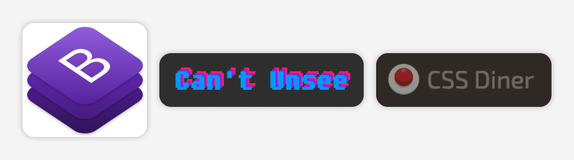
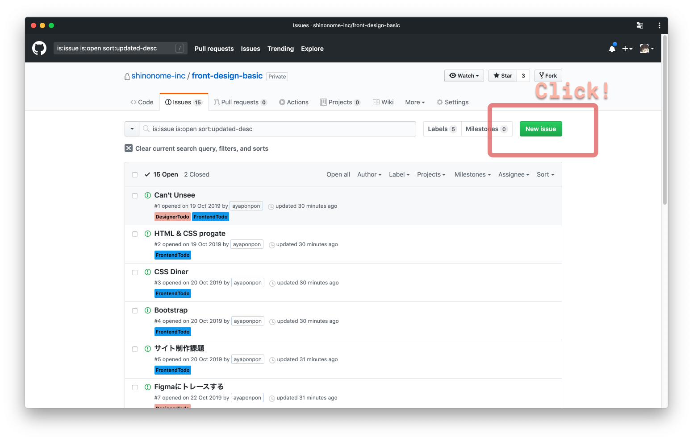
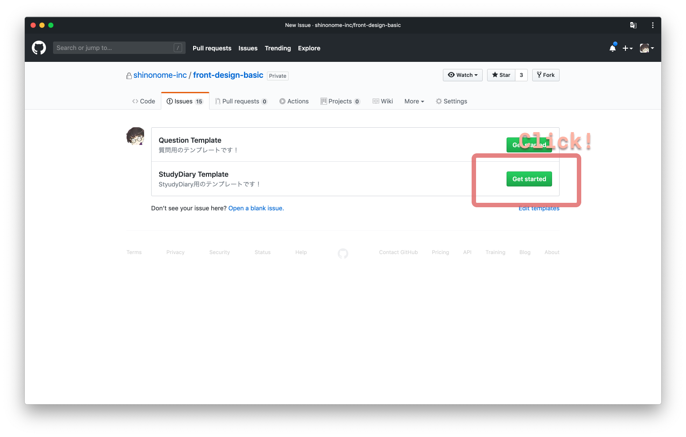
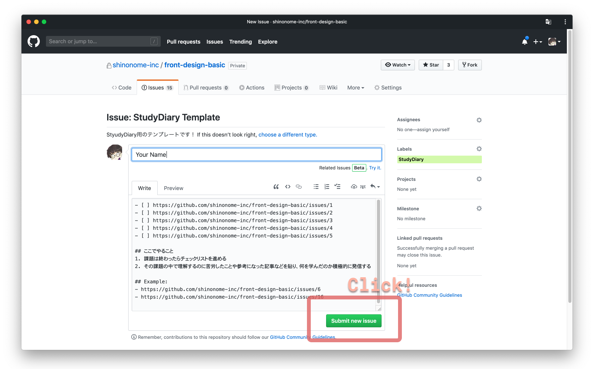
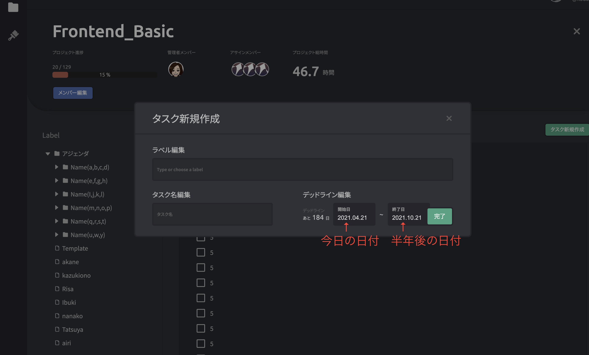

# コースの進め方

このコースではたくさんの課題があります。課題を全てクリアしたところでコース終了となります。課題を行うには以下の手順が必要です。

## 1. Slack

slack のチャンネル（`#dev_frontend`）に参加してください。

基本的に事務連絡は slack の`#dev_frontend`で行います。

## 2. Study Diary

### 2.1. 以下の手順で[StudyDiary の Example](https://github.com/shinonome-inc/frontend-basic/labels/StudyDiaryExample)と同じ様に自分の Issue を立てる

Study Diary は 1 人 1 個だけで良いです。複数個作ってしまった場合は、close しておいてください。

::: div c2
::: div lc

:::
::: div rc

### 2.2. New Issue をクリック

:::
:::

::: div c2
::: div lc

:::
::: div rc

### 2.3. StudyDiary のテンプレートを選択

:::
:::

::: div c2
::: div lc

:::
::: div rc

### 2.4. Issue のタイトルに自分の名前などを記入して Submit Issue をクリック

右側のサイドバーの assignees は自分を選択してください
:::
:::

## 3. Playground アプリ

### 3.1. 自分のタスクを作成する

作成方法は、動画で解説されているので、動画のとおりに設定をしてください。

- [動画 1](https://www.youtube.com/watch?v=I5ccnGpVuyI)
- [動画 2](https://www.youtube.com/watch?v=5gSkfM2efNo)

コース名は動画の通り「Frontend_Basic」です。

タスクを作成する際、動画ではデッドラインが設定されていませんでしたが、フロントエンドコースではデッドラインを設定してもらうので、下の手順で進めてください。

- 開始日は、今日の日付を選択してください。
- 終了日は、今日から 6 ヶ月後の日付を選択してください。
- 説明会等で聞いていると思いますが、コース課題は原則 6 ヶ月以内で終わらせる必要があるためです（目標は 3 ヶ月）。詳細は下記に示すのでそちらもご覧ください。
- Playground アプリに関してわからないことは Slack のチャンネル`#help_center`で質問してください。

### 3.2. 学習時間の計測

動画で解説されているように、ポモドーロを回すことで学習時間を計測することができます。定例会後に学習申告フォームに回答する際に週 10 時間学習できたか確認するので、フロントエンドコースの勉強をするときはポモドーロを使用するようにしてください。

---

# 学習に必要な期間について

個人的な見解ですが、基礎学習を終えるまでの期間が短いと案件や個人開発に入れる期間が増え、モチベーション維持につながると思います。

したがって、３ヶ月で全部の課題を終えられることを目標にしてほしいと考えています。

大雑把ですが、3 ヶ月を目標とする場合、以下の期間を目標として捉えていただきたいです。

- はじめ〜chapter3 終了...1 週間

- chapter4 終了...1 週間

- chapter5...平均 4 日 \* 18 タスク = 72 日

合計で 90 日程度。

ただし、chapter5 は、最初の簡単なタスクは 1,2 日で終わらせないと難しいタスクは結構時間がかかります。そのため、効率的に作業をする方法を考えなければなかなか終わらないと思います。

もちろん、学校の授業が忙しいときはそちらを優先するなど、臨機応変に対応してください。

また、chapter5 でコードを書く部分はレビューしてもらう時間と、レビューした結果修正が必要なら修正&再レビューにかかる時間を考慮しておく必要があります。

---

# それぞれの課題が終わったら

それぞれの課題が終わったら、

- [StudyDiary の Example](https://github.com/shinonome-inc/frontend-basic/labels/StudyDiaryExample)と同じ様に、課題の復習や感想をコメントに書く
- Play Ground アプリ の frontend-basic プロジェクトの Todo リストを更新する
- 全ての課題が終わるまで繰り返し、どんどん進めましょう！
