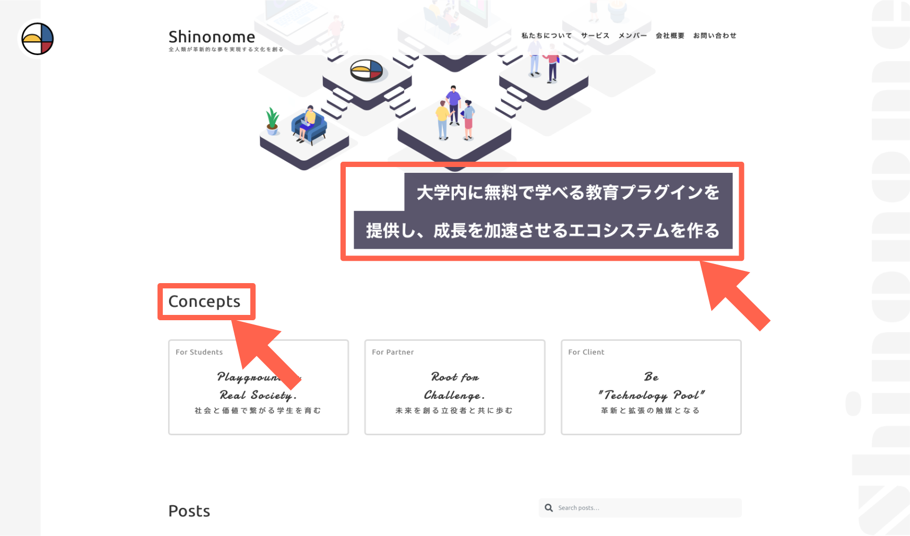

::: div c5
::: div lc

:::
::: div rc
**トム - 物語の主人公 -**

最先端の仕事がしたいと考えていたトムは、インターネットにはいろいろな WEB サービスがあることに気がつき興味を持った。そして、ある WEB サイト制作会社のインターンをすることにした。
:::
:::

## WEB サイトは言葉で出来ている

インターネット上には多くの WEB サイトがある。

それらは見た目や動きがそれぞれ違うが、一つ共通していることがある。みんなが見ている画面の裏側では言葉によって記述されているということだ。文字の大きさや色もどの画像を表示するかもリンクをクリックするとどのページに移動するのかも、全て言葉によって表現されている。

WEB サイトの見た目をイメージし、言葉でどのように表現するかを考えることを{Web Design}^(WEB デザイン)と呼ぶ。この学習コースはそんな WEB デザインに興味を持ったトムと一緒に学習を進めていく。

::: div c2
::: div lc

:::
::: div rc

### WEB サイトを見てみよう 1

Shinonome のホームページには画像やいろいろな文字に装飾が施されている。これら文字の大きさと色も言葉によって表現されている。

リンク：[https://shinonome.io](https://shinonome.io)
:::
:::

::: div c2
::: div lc

:::
::: div rc

### WEB サイトを見てみよう 2

このコースで作成する、カフェのサイトは PC はもちろん、スマホなどの画面でもレイアウトの違和感なく、閲覧することができる。  
これをレスポンシブなサイトという。レスポンシブにサイトを作ることが大切だ。  
他にもマウスアクションなどを観察しておこう。

リンク：[https://demo.tcd-theme.com/tcd063/](https://demo.tcd-theme.com/tcd063/)
:::
:::

## チャンスは待ってくれない

トムは WEB サイト制作会社"ミニマムズコーポレーション"でインターンを始めた。

初めての出社で張りきって出勤すると、なんだか社員たちがたくさん集まって騒々しい様子……

どうやら近々納品のプロダクトのプログラマーが風邪をひいてしまったようだ。このままだと期日に間に合わないと騒いでいる。

プロダクトオーナーはしばらく考えるそぶりを見せると思いついたように辺りを見回した。 そして、トムと目が合うとニッコリと笑った。

あまり良くないタイミングで来てしまったみたいだ。初日から忙しくなりそうだ。

## まずは書いてみる。それが基本

::: div c5
::: div lc

:::
::: div rc
**アレン - {Frontend}^(フロントエンド) {Engineer}^(エンジニア) -**

ユーザーが見る画面（フロントエンドと言う）の{UI}^(ユー アイ)（{User}^(ユーザー) {Interface}^(インターフェイス)）やデータの流れを作る。その領域の一部である WEB デザインもこなす。
:::
:::

アレンがトムのメンター（師匠のこと）になってくれた。彼はトムを席に着かせると開口一番、さっそく書いてみようと言った。

早速{Programming}^(プログラミング)を始めよう。

::: div c2
::: div lc

:::
::: div rc

### プログラミングとは何だろうか

普段書く文字に加えて文字や画像の大きさを装飾する言葉が含まれている文章を{Code}^(コード)と呼び、コードを書くことをプログラミングと呼ぶ。

プログラミングは運動と同じだ。成り立ちや理論を勉強しているだけではできるようにならない。自分で試行錯誤をしてはじめて書けるようになる。
:::
:::

この学習コースはトムと一緒に実際にプログラミングすることで試行錯誤してもらうようになっている。

プログラミングに慣れることを重視しているので、最低限の技術の成り立ちと理論しか説明しない。詳しいことが知りたくなったらページの最後にある参考文献を読んでほしい。

参考文献の中には検索フレーズも書いてある。このページを学習したら気になりそうなフレーズを書いておいた。気になったフレーズは自分で検索してみよう。

## 書く準備をしよう

学習は{CodeSandbox}^(コードサンドボックス)という WEB サービスを使って行う。CodeSandbox は自分の書いたコードを同じ画面で確認することができる WEB サービスだ。

各学習の前に基本となるコードをアレンが用意してくれている。（{Template}^(テンプレート)と呼んでいる）
これに自分で書き加えながら進めていくことで変更をすぐに確認しながら学習を進めていくことができる。

https://codesandbox.io/s/01-01-01-znks3?autoresize=1&fontsize=14&hidenavigation=1&view=split

上のような枠がページの途中で表示されたら、枠の右下の「Open Sandbox」
をクリックして新しいタブで CodeSandbox を開こう。

下の動画で CodeSandbox の使い方を説明している。左の黒い画面がコードを書く画面であり、右の白い画面が実際の表示を確認する画面になっている。真ん中の文章がコードである。コードを変更した後は画面左上の File から Save をクリックする。（この操作は mac の場合はキーボードの`command`+`s`でもできる。windows の場合はキーボードの`ctrl`+`s`でできる）右側の白い画面で表示が変更されたことがわかる。

学習は「学習コースでコードの見本を見る」→「CodeSandbox で基本コードに変更を書き加える」→「変わっていることを確かめる」の繰り返しで進んでいく。サイクルの一周に時間をかけるのではなく何周もすることを心がけ、慣れることに努める方が早く書けるようになる。

それでは、トムと一緒に WEB デザインを始めよう。

## 参考文献

### WEB サイトと本

- [今さら聞けない！Web デザインとは【初心者向け】](https://techacademy.jp/magazine/7942)
- [CodeSandbox](https://codesandbox.io)

### 検索フレーズ

[`HTML 入門`](https://www.google.com/search?q=HTML+%E5%85%A5%E9%96%80)
[`CSS 入門`](https://www.google.com/search?q=CSS+%E5%85%A5%E9%96%80)
[`WEBサイト 歴史`](http://google.com/search?q=WEB%E3%82%B5%E3%82%A4%E3%83%88+%E6%AD%B4%E5%8F%B2)
[`UI`](https://www.google.com/search?q=UI)
